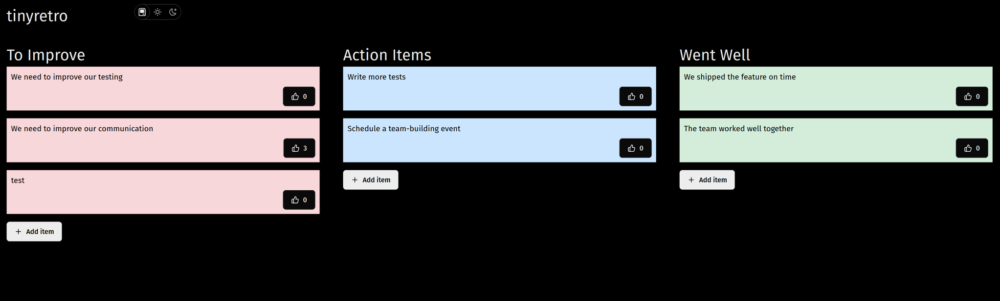

# tinyretro

A small sprint retro application I made to learn Rust and svelte



This app uses Rust on the backend, with a JS frontend with SvelteKit with server-side rendering turned off.

## To debug

```bash
> make server-debug
> make client-debug
```

The server doesn't currently support hot reload

## To Run

## Features

- Anonymous contributions
- TODO: Vote limit
- TODO:
- Persistence via:
  - json
  - TODO: sql (lite)
  - TODO: dyanmo
- TODO: Export to:
  - Markdown
  - json
